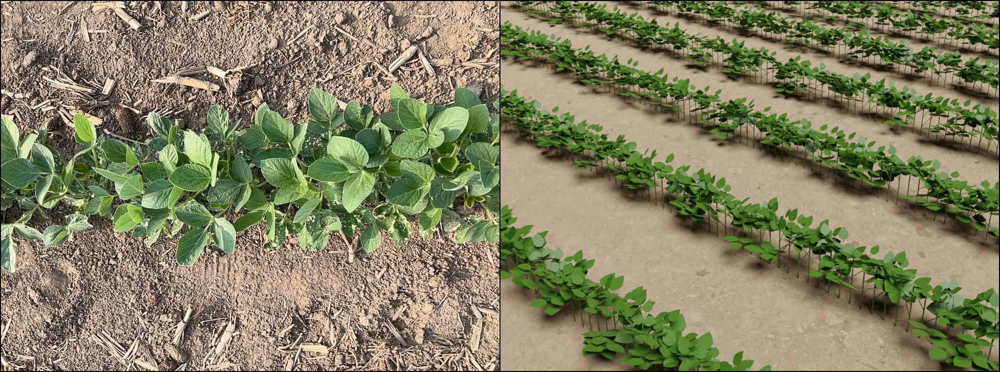

# CropCraft: Complete Structural Characterization of Crop Plants From Images

Albert J. Zhai, Xinlei Wang, Kaiyuan Li, Zhao Jiang, Junxiong Zhou, Sheng Wang, Zhenong Jin, Kaiyu Guan, Shenlong Wang<br/>

3DV 2026 (Oral)

[Paper](https://arxiv.org/abs/2411.09693) │ [Project Page](https://ajzhai.github.io/CropCraft/)


**TL;DR: Create 3D digital twins of crop fields from images**<br/>


## Setup
### Installing Dependencies
First, you should install the version of Nerfstudio included in this repository. The steps to do so are as follows.

Create a conda environment:
```bash
conda create --name cropcraft -y python=3.8
conda activate cropcraft
pip install --upgrade pip
```

Install PyTorch with CUDA and tiny-cuda-nn:
```bash
pip install torch==2.0.1+cu118 torchvision==0.15.2+cu118 --extra-index-url https://download.pytorch.org/whl/cu118

conda install -c "nvidia/label/cuda-11.8.0" cuda-toolkit
pip install ninja git+https://github.com/NVlabs/tiny-cuda-nn/#subdirectory=bindings/torch
```

Install Nerfstudio:
```bash
cd nerfstudio
pip install --upgrade pip setuptools
pip install -e .
```

You can consult the [official Nerfstudio repo](https://docs.nerf.studio/quickstart/installation.html) if you encounter trouble with the above.


Afterwards, install the (very few) remaining dependencies for CropCraft:
```bash
cd ..
pip install -r requirements.txt
```
## Data
Our code expects scene data (multi-view images + camera parameters) in Nerfstudio format. See the [official Nerfstudio docs](https://docs.nerf.studio/quickstart/custom_dataset.html) for instructions about how to convert your own data into this format.

We provide datasets for soybean and maize fields collected near UIUC. These can be downloaded from the links below. The soybean data is captured using Polycam on an iPad Pro. The maize data is captured from a UAV using a high-resolution camera, so it is much larger in file size. See Section 4 of our paper for more info about the data.

**[Download soybean data (0.9 GB)](https://uofi.box.com/shared/static/mtgt440bolnq9hqvn6xis4crbuxikcux.zip)**

**[Download maize data (71 GB)](https://uofi.app.box.com/shared/static/drv88sd6w32eig4ju0c2xbapbnfsop41.zip)**

Create a directory at `./data` and unzip the data files there. Both files contain the same GT `field_measurements`, so you only need one copy of that.

## Usage
Our method consists of multiple steps that need to be executed in order. Each step is handled by a separate script, with example usage shown below. Each script will save outputs in the specified work directory (`./work_dirs/` by default). Some steps may require hyperparameter adjustment to work well, depending on the scene. See `arguments.py` for the list of arguments for each script.


### Train NeRF
```bash
python train_nerf.py --data_dir ./data/soybean --scene_name 20230801_S1
```
### Align rows and render depth
```bash
python align_and_render.py --scene_name 20230801_S1
```
### Fit procedural morphology model
```bash
python fit_soybean_o3d.py --scene_name 20230801_S1
```
### Visualize 3D model
```bash
python visualize.py --scene_name 20230801_S1
```
### Evaluate performance metrics
```bash
python evaluate.py --scene_name 20230801_S1
```
The visualization and evaluation scripts can be executed in any order.

## Citation
If you find this paper and repository useful, please consider citing:
```bibtex
@inproceedings{zhai2026cropcraft,
  title={CropCraft: Complete Structural Characterization of Crop Plants From Images},
  author={Zhai, Albert J and Wang, Xinlei and Li, Kaiyuan and Jiang, Zhao and Zhou, Junxiong and Wang, Sheng and Jin, Zhenong and Guan, Kaiyu and Wang, Shenlong},
  booktitle={International Conference on 3D Vision (3DV)},
  year={2026}
}
```